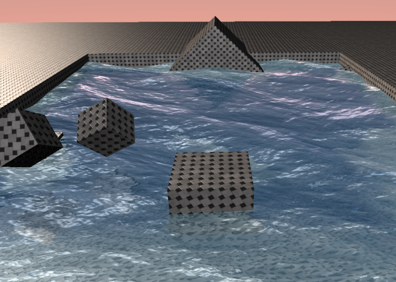

# Water shader

Youtube demo: https://youtu.be/zg3mEDNXRUE
The shader uses reflections, refractions, realistic wave motion and water caustics.

Water shader made using Direct3D. The shader uses multiple techniques from:
https://developer.nvidia.com/gpugems/gpugems/part-i-natural-effects/chapter-1-effective-water-simulation-physical-models
https://developer.nvidia.com/gpugems/gpugems/part-i-natural-effects/chapter-2-rendering-water-caustics

### This is a fork of: hw3d
C++ 3D graphics engine under Direct3D 11. Developed in a Planet Chili video tutorial series that can be found on YouTube. https://youtu.be/_4FArgOX1I
